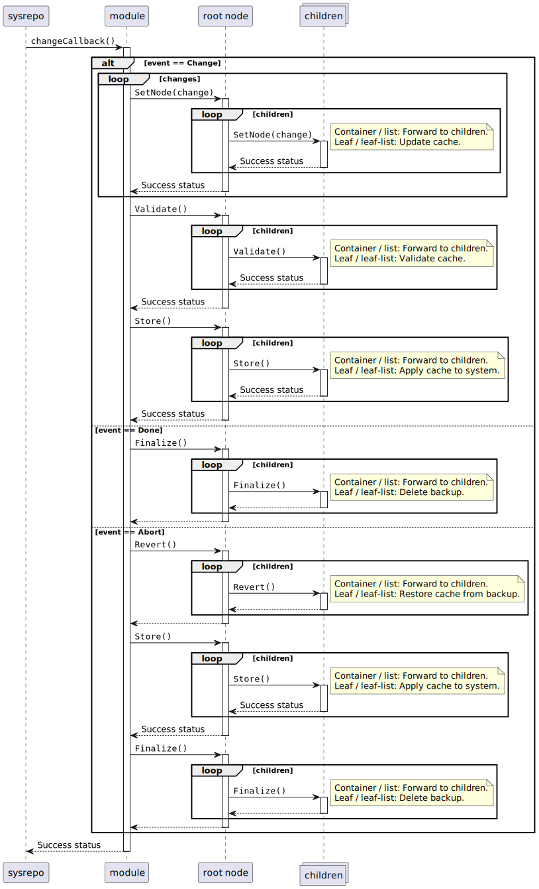

# Sequence Diagrams
 
On plugin startup first of all the main Yang modules are registered, which constructs their corresponding root node objects. The constructors of the different Yang node types behave as follows: 
- Container: Implicitly construct its children.
- List: **Needs to be implemented manually** to populate the list by reading the system.
- Leaf and leaf-list: Call `Load()` in order to initialize its internal cache.

After registering the modules the system has been loaded into the local cache of the Yang nodes. From that both the operational and running datastores are initialized. After registering sysrepo callback subscriptions, the initialization phase is finalized by copying the startup datastore into the running datastore in order to apply persistent configuration items to the system. Afterwards, the only task of the plugin is to handle sysrepo callbacks, which are triggered by external applications that
- want to read operational data,
- want to set some configuration items, or
- want to trigger an RPC.

_Note_: RPC functionality has not yet been fully implemented in the generated code.

## Initialization of Sysrepo Plugin

## Operational Callbacks

***Note***: By default operational callbacks are disabled since sysrepo doesn't support mixing both operational _pull_ and _push_ data since a deadlock may occur.

## Change Callbacks

When a change to the running datastore is requested then sysrepo provides the following events for subscribed clients:
1. **Update**: Allows patching the request before forwarding it to regular client subscriptions.
2. **Change**: Allows a client to grant or reject a change. This is when the generated plugin configures the system already so that it can reject the change in case that fails.
3. **Done**: The change has been committed. We can finalize the transaction by tagging our internal cache as being in sync with the system settings.
4. **Abort**: The change has been rejected by some client. We need to restore the previous system settings that are still in our backup cache.

The generated code implements these steps as shown in the following figure.

